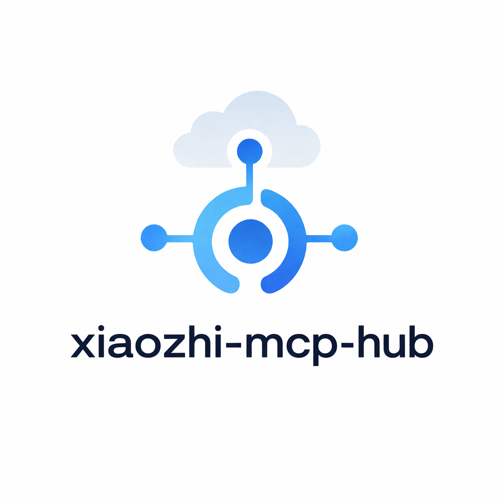

<p align="center">
  
</p>

# Xiaozhi MCP Hub

**语言：** [English](./README.md) | 简体中文

Xiaozhi MCP Hub 是面向小智官方 MCP 接入点的 MCP 聚合网关。它作为一个上游 MCP Server 连接小智官方服务，同时向下连接多个 MCP Server，自动发现工具、规范化工具 schema，并把这些工具以统一目录暴露给小智。

这个项目解决的核心问题是：让现有 MCP 工具可以快速接入小智，同时保留后台管理、权限控制、高危审批、审计日志和运行观测这些生产环境需要的能力。

## 核心能力

- 通过 WebUI 配置小智官方 MCP 接入点。
- 聚合 `stdio`、Streamable HTTP、兼容旧 SSE 的下游 MCP Server。
- 自动执行 `initialize`、`notifications/initialized`、`tools/list`，并把发现到的工具写入注册中心。
- 将小智侧的 `tools/call` 路由回对应下游 MCP Server 的原始工具名。
- 内置 `hub.status` 默认工具，方便小智后台确认 Hub 已接入。
- 提供 React 管理后台：首次管理员注册、小智接入、下游服务、工具注册、配置导入、高危审批、审计日志。
- 提供生产级基础能力：RBAC、工具 ACL、审批流、Trace ID、审计日志、健康状态和 Prometheus 指标。

## 架构

```text
小智官方 MCP 接入点
        |
        | WebSocket MCP bridge
        v
Xiaozhi MCP Hub
        |
        | 工具注册 + ACL + 审批 + 审计
        v
下游 MCP Server
  - stdio
  - Streamable HTTP
  - legacy SSE-compatible HTTP
```

暴露给小智的工具名使用统一 `tool_id`：

```text
{namespace}.{origin_tool_name}
```

如果多个下游服务出现同名工具，Hub 会追加 server id：

```text
home.turn_on_light__ha-prod
```

## 快速启动

```powershell
Copy-Item .env.example .env
docker compose up --build
```

默认访问地址：

- WebUI: `http://localhost:5173`
- Backend API: `http://localhost:8000`
- OpenAPI: `http://localhost:8000/docs`
- Prometheus metrics: `http://localhost:8000/metrics`
- Grafana: `http://localhost:3000`

首次部署时，如果数据库中没有管理员，打开 WebUI 后可以在登录页注册第一个账号。第一个注册用户会自动成为后台管理员，之后公开注册入口会关闭。

## 接入小智官方 MCP

1. 在小智后台复制官方 MCP 接入点。
2. 打开 Hub WebUI。
3. 进入“小智接入”页面。
4. 渠道选择“小智官方”。
5. 粘贴接入点并启用。

小智接入点只通过 WebUI 或配置导入管理。

## 接入下游 MCP 服务

可以在 WebUI 手动新增下游服务，也可以导入 YAML/JSON 配置。

项目原生格式：

```yaml
servers:
  - id: local-demo
    transport: stdio
    command: python.exe
    args: ["../examples/downstream-mcp/demo_server.py"]
    namespace: demo
    enabled: true
```

兼容常见 `mcpServers` 格式：

```json
{
  "mcpServers": {
    "demo": {
      "command": "python.exe",
      "args": ["../examples/downstream-mcp/demo_server.py"],
      "namespace": "demo"
    },
    "remote-tools": {
      "type": "streamable_http",
      "url": "https://example.com/mcp"
    }
  }
}
```

导入后，Hub 会自动发现启用服务的工具。只有成功发现并写入工具注册中心的工具，才会暴露给小智。

## MCP 兼容性

| 传输方式 | 状态 | 说明 |
| --- | --- | --- |
| `stdio` | 已支持 | 兼容常见 Node.js / Python MCP 工具服务。 |
| `streamable_http` | 已支持 | 支持 JSON-RPC POST、session header、Bearer 引用和 API key 引用。 |
| `sse` | 兼容路径 | 兼容仍提供 JSON-RPC POST 端点的旧版 SSE 服务。 |

当前版本聚焦工具型 MCP Server：

- `initialize`
- `notifications/initialized`
- `tools/list`
- `tools/call`

`resources`、`prompts`、`sampling` 和完整 OAuth 授权向导属于后续扩展范围。

## 下游 MCP 示例

项目内置了一个无第三方依赖的 stdio MCP 示例服务：

```text
examples/downstream-mcp/
```

它暴露以下工具：

- `demo.echo`
- `demo.add`
- `demo.get_server_status`

在 WebUI 的“配置导入”页面导入 `examples/downstream-mcp/hub-config.yaml` 即可体验。

如果你要专门为本项目开发下游 MCP 服务，请注意：

- `stdout` 只能输出 JSON-RPC 协议消息。
- 日志和诊断信息请输出到 `stderr`。
- 每个工具都要提供清晰的 `description` 和 `inputSchema`。
- 工具结果使用 MCP `CallToolResult` 结构：`content`、可选 `structuredContent`、`isError`。
- 使用稳定的 namespace，避免和其他服务的工具名冲突。

## 本地开发

后端：

```powershell
cd backend
python -m venv venv
.\venv\Scripts\pip install -r requirements.txt
Copy-Item .env.example .env
.\venv\Scripts\uvicorn app.main:app --reload
```

`backend/.env.example` 默认使用 `STORE_BACKEND=memory`，适合本地快速启动，不依赖 Postgres。

前端：

```powershell
cd frontend
npm install
npm run dev
```

本地开发时，Vite 会把 `/api/*` 代理到 `http://127.0.0.1:8000`。

## 测试

后端：

```powershell
cd backend
.\venv\Scripts\python.exe -m unittest discover -s tests
```

前端：

```powershell
cd frontend
npm run build
```

## 安全默认值

- 不会把小智上游 token 透传给下游 MCP Server。
- `high` / `critical` 风险工具默认进入 WebUI 审批。
- 凭据通过 secret ref 引用，API 响应中不展示明文 secret。
- 每次 MCP 调用都会生成 Trace ID 并写入审计日志。
- 内置角色：`admin`、`operator`、`viewer`。

## 项目结构

```text
backend/              FastAPI 后端和 MCP Hub 核心
frontend/             React + Vite 管理后台
examples/             可导入配置和下游 MCP 示例
deploy/               Prometheus 配置
docker-compose.yml    本地完整部署编排
```

## 相关项目

- xiaozhi-esp32: https://github.com/78/xiaozhi-esp32
- mcp-calculator: https://github.com/78/mcp-calculator
- Model Context Protocol: https://modelcontextprotocol.io/specification
